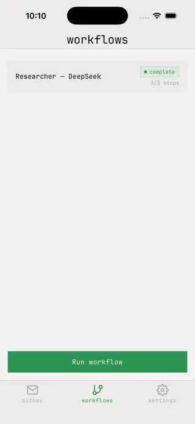

# React Native Workflow Demo

[Mastra-style](https://mastra.ai/docs/workflows/overview) workflows on top of [LangChain JS](https://reference.langchain.com/javascript/langchain), running on-device.

## Demo



## Models

Allows usage of DeepSeek or Anthropic API keys with latest models, or llamacpp (local) assumed to be accessible on the same machine as the running emulator/simulator.

## Get started

1. Install dependencies

   ```bash
   pnpm install
   ```

2. Start the app

   ```bash
   pnpm expo start
   ```

In the output, you'll find options to open the app in a

- [development build](https://docs.expo.dev/develop/development-builds/introduction/)
- [Android emulator](https://docs.expo.dev/workflow/android-studio-emulator/)
- [iOS simulator](https://docs.expo.dev/workflow/ios-simulator/)
- [Expo Go](https://expo.dev/go), a limited sandbox for trying out app development with Expo

This project uses [file-based routing](https://docs.expo.dev/router/introduction).
